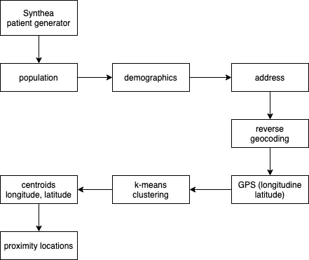
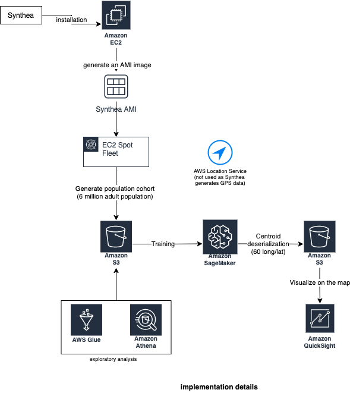
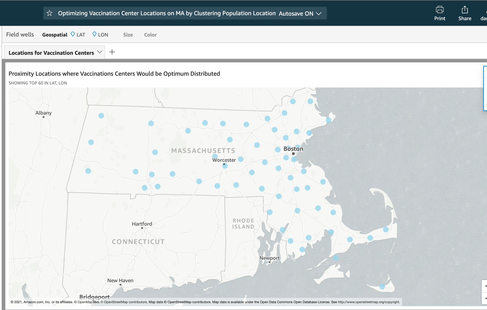

# README

# Synopsys

This is a simple project that uses a machine learning approach in order to find an optimum proximity locations for covi19 vaccination centers based on a population address data set.

The algorithm used is k-means (unsupervised clustering algorithm).

The population has been generated using Synthea ([https://synthetichealth.github.io/synthea/](https://synthetichealth.github.io/synthea/)) a synthetic patient generator.

The implementation is done using AWS services.

All the resouces (including training data and model artifacts) are temporarely publicly available @ s3://synthetic-population-analysis-01.

# Scenario/Goal

This example fast, draft implementation project is attempting at solving the following fictitious scenario: find geographic locations that optimizes fast access to vaccination centers (the assumption is that close proximity provides easier access).

Goals:

1. vaccinate the entire Massachusetts population in 100 days (the state has been chosen &quot;almost&quot; at random)
2. find the proximity locations for vaccinations centers (each proximity location will be used to identify a center that is appropriate for vaccination – might be a hospital, clinic, pharmacy etc)
3. the proximity locations need to be optimized such that it will be close to the population in order to increase adherence and minimize travel time, gas consumption etc

# Premises

## Estimate population size

MA population:

([https://www.census.gov/quickfacts/MA](https://www.census.gov/quickfacts/MA)):

6,892,503

## Estimated adult population

Based on

[https://www.census.gov/quickfacts/MA](https://www.census.gov/quickfacts/MA)

It looks like 19.6% is under 18 – as such I estimate that 80% of the population is adult

Adult population (estimate):

6,892,503 \* 0.8

Estimate 5,500,000 adults

## Estimate daily bandwidth need for vaccinations

Adult population divided by 100 days:

55,000

## Estimate number of centers needed for vaccination

Estimate per center daily bandwidth (arbitrarily): 1000

Then an estimate of at least 55 centers.

Adjust upward for increase adherence: 60 centers.

# Architecture

The following diagram presents the workflow

The following diagram presents the actual implementation with the used services

# Results

The QuickSight print screen

# Artifacts

Population – split into 6 files - each containing 1,000,000 synthetic patient demographics.

Notebook – SageMaker notebook

Model Artifacts – results from training

Results – the GPS long/latitude of the centroids
